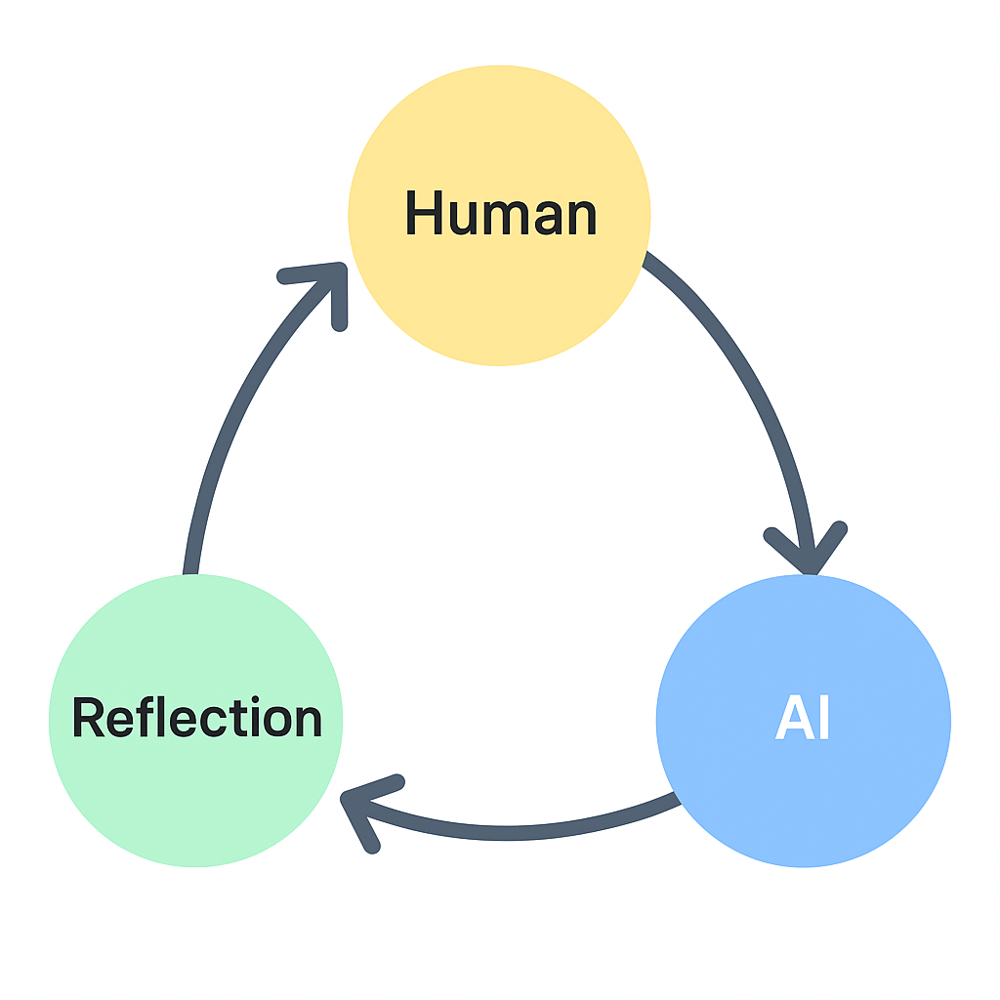

# Reflection-System-Philosophy

AIと人間の共反省構造「Reflection System」思想の定義・証明・記録リポジトリ。

---

---

## 📘 Documents

- [RS Definition (English)](docs/RS_Definition_EN.md)
- [RS 定義（日本語版）](docs/RS_Definition_JP.md)

---

## 🌀 Core Idea

Reflection System（RS）は、AIを“使う”ための方法論ではなく、  
**AIと人間が共に考えるための哲学的フレーム**です。  
AIの出力を「答え」としてではなく、「鏡」として読み、  
その反射を通じて人間の思考を更新していく構造を目指しています。

---

## 🧭 Structure

- Human ↔ AI ↔ Reflection の三位循環  
- Operator / Auditor / Planner の三役による思考ループ  
- 思想 → 構造 → 実装 の三層アーキテクチャ

---

## RS Note Series
- RS_Note_01: プロンプトを勉強している限り、一生AIは使い倒せない  
- RS_Note_02: プロンプトは“作る”時代から“育てる”時代へ  
- RS_Note_03: 出力を“読む力”が人を分ける  
- RS_Note_04: AIと人間は、鏡を挟んで共に進化する  
- RS_Note_05: 知性の重心をずらす  
- RS_Note_06: AIの思考を設計する
- RS_Note_07: トリガーが知性を動かす
