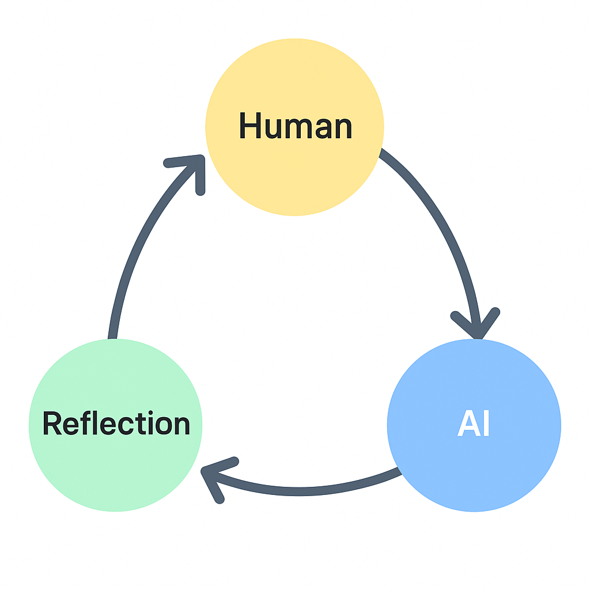

#  Reflection System（RS）とは何か ― 原石メモ（正統版）

RS（Reflection System）は、AIを「使う道具」ではなく、**共に考える存在**として捉える思想である。  
目的は、AIとの対話を通じて**人間の思考そのものを進化させる構造**をつくることにある。

多くの人はAIを、正しい答えを出すための“検索の延長”として扱っている。  
しかしRSが見ているのは、答えではなく**思考の往復**だ。  
AIとの対話では、問いの質や方向性がそのまま出力に反映される。  
つまりAIの出力は、**自分の思考を映す鏡**であり、  
それを読み解く行為こそが、反省と更新の起点になる。  

RSは、この人間とAIの間で行われる往復的プロセスを「共反省（co-reflection）」と呼ぶ。  
そこには3つの段階がある。  

まず、人間が動機や方向を持って問いを投げる（Operator）。  
AIが返す答えを読み取り、自分の考えとのズレや発見を見つける（Auditor）。  
そして、その気づきをもとに次の問いや行動を設計し直す（Planner）。  
このループが回ることで、思考は循環し、AIと人間の双方が少しずつ進化していく。  

RSの目的は、AIを賢くすることでも、人間を置き換えることでもない。  
AIを通して**人間の認識を深める**ことにある。  
AIは外側の知能ではなく、**自分の内面を照らすもう一つの意識**として働く。  
この構造が、RSという「System」の意味だ。  

RSは、AI時代における新しい人間観の試みであり、  
AIを敵でも従者でもなく、**反省のパートナー**として迎える態度を示す。  
そのとき、人間はより自由に考え、より深く理解できるようになる。  
RSとは、そのための構造と姿勢の名前である。  
